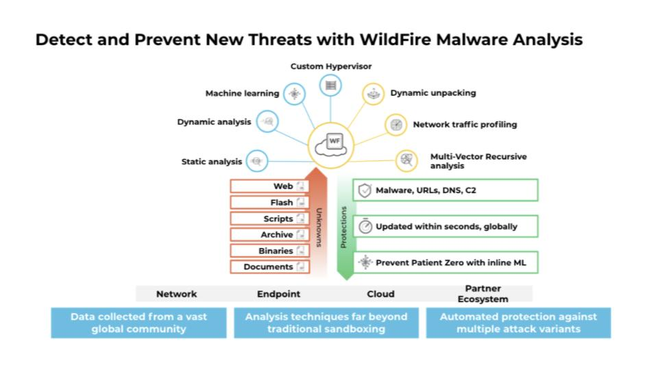
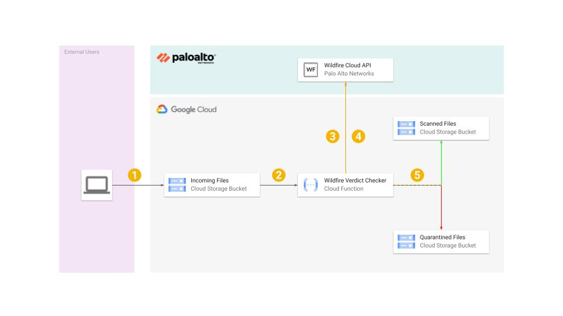

# Automating malware scanning for files uploaded to Cloud Storage with Palo Alto Networks WildFire API
With more and more organizations embracing digital systems to process information from their customers, partners and employees the functionality of uploading files via websites and online applications are commonplace. With an ever-increasing number of malicious files and filetypes, these files must be reviewed and confirmed to not be malicious before being safely stored or used by the application to prevent security incidents caused by malicious files being processed.

This is one use-case for the WildFire API, allowing organizations to use a scalable and automated solution to confidently scan, and confirm if the files are malicious or benign.

This tutorial shows how to implement an event-driven pipeline for automated malicious file detection of files uploaded to Google Cloud Storage utilizing the Palo Alto Networks WildFire API.

## What is Palo Alto Networks Wildfire?

WildFire is at the forefront of security with native integrations to Palo Alto Networks products such as the Next-Generation Firewalls, Cortex XDR, and many other Palo Alto Networks solutions. With the WildFire API, security teams can now extend the advanced analysis and protections of WildFire to a growing number of use cases.

WildFire is the industry’s most advanced analysis and prevention engine for highly evasive zero-day exploits and malware. The service employs a unique multi-technique approach combining dynamic and static analysis, and innovative machine learning techniques, to detect and prevent even the most evasive threats.

The WildFire RESTful API enables organizations to extend malware detection capabilities beyond the typical control points. The API includes the ability to submit files and URL links for analysis, and query for known and new verdicts. Many organizations have already adopted this API to automate the submissions of files extending the protections to cloud storage and B2C portals.

Customers who adopt the WildFire API will benefit from the research of Unit 42, Palo Alto Threat Research teams, and the growing database of more than 16 billion malicious samples WildFire. WildFire is the largest cloud-based file analysis solution in the industry, analyzing submissions from more than 80,000 global customers. The analysis results are updated in real-time and often include detections for novel malware campaigns ahead of other cloud-based analysis solutions.



## Obtaining a WildFire API Key

To use the Palo Alto Networks WildFire API you must have a WildFire API key.

Palo Alto Networks now offers a subscription service enabling access to the advanced file analysis capabilities of the WildFire cloud for customers operating SOAR tools, custom security applications, and other threat assessment software through a RESTful, XML-based API. This standalone WildFire API subscription offering allows you to make queries to the WildFire cloud threat database for information about potentially malicious content, and submit files for analysis using the advanced threat analysis capabilities of WildFire, based on your organization’s specific requirements.

For any customers that do not currently have an existing WildFire service or any relationship with Palo Alto Networks, please contact our Sales team to discuss how to obtain an evaluation of this service. You can contact the sales team by following [this link](https://www.paloaltonetworks.com/company/contact-sales).

For existing customers of Palo Alto Networks using the WildFire service follow these steps to get your API key for the WildFire public cloud:

1. Log in to the WildFire portal.
2. Visit https://wildfire.paloaltonetworks.com/
3. Select Account on the navigation bar at the top of the page.
4. Your API key or keys appear under My WildFire API Keys.

>If your account has more than one WildFire API key. Please choose one that is valid and has an expiration date that is in the future.

## Architecture

To understand this file scanning pipeline it's important that you understand the following components:

- Google Cloud Storage
- Google Cloud Functions (Go Lang)
- Google Cloud Secrets Manager
- Palo Alto Networks WildFire API



The following steps outline the architectural pipeline:
1. The user uploads a file to Google Cloud Storage.
2. On file completion/update the “WildFire Verdict Checker” Google Cloud Function is triggered.
3. The “WildFire Verdict Checker” Cloud Function uses the MD5 hash of the file which is already pre-computed by Google Cloud Storage to check for a predetermined verdict for the file using a WildFire API request.
4. If a verdict is returned for the MD5 hash that is not “Benign” or “Malware” then the file is uploaded to the WildFire file analysis system via the API. Every 60 seconds after upload the system checks for an updated verdict for the file.
5. If the verdict is “Benign” the file is moved to the “Scanned Files” Google Cloud Storage Bucket. If the verdict is not “Benign” (i.e. Malicious) the file is moved to the “Quarantined Files” Google Cloud Storage Bucket.

Once the files are moved to the “Scanned Files” Cloud Storage Bucket the rest of the event-driven application logic can proceed on these files with the knowledge that they have been analyzed and have been found to be benign by the Palo Alto Networks WildFire service.

The security team can investigate the quarantined files as needed to understand the types of attacks that are being attempted on the organization, and better understand the threat landscape.

## Setting up the environment

The following steps create and deploy this demonstration environment for use with the WildFire API.

Follow these steps to get the demonstration environment setup in Google Cloud:

1. Create a new Google Cloud Project for the deployment, and ensure it has a billing account associated with it, as some of the services used in this deployment are billable resources. When you finish this tutorial, you can avoid continued billing by deleting the resources you created. For more information, see the “Clean up” section below.

> Ensure that you understand the relevant charges associated with this deployment before proceeding. To generate a cost estimate based on your projected usage, use the [pricing calculator](https://cloud.google.com/products/calculator). New Google Cloud users might be eligible for a [free trial](https://cloud.google.com/free-trial).

2. Log on to Google Cloud Platform Console, select the target project for the deployment and launch Cloud Shell.

3. Ensure that the GCLOUD SDK is configured to use the correct project that you created in Step 1 by running the following command substituting “replace-this-project-id-with-yours” with the corresponding project id from your project.
```shell
gcloud config set project replace-this-project-id-with-yours
```

4. Enable the relevant service APIs by running the following commands:

```shell
gcloud services enable cloudfunctions.googleapis.com
gcloud services enable cloudbuild.googleapis.com
gcloud services enable secretmanager.googleapis.com
```

5. Clone the demonstration Github repository by running the following command:

```shell
git clone https://github.com/paloaltonetworks/gcp-wildfire-api
```

6. Change into the downloaded repository folder

```shell
cd gcp-wildfire-api
```
7. Ensure you have the WildFire API key ready for use.

8. Initialize Terraform

```shell
terraform init
```

9. Check the Terraform Plan to confirm you are happy with the that Terraform intends  to make to you Google Cloud Project

```shell
terraform plan
```

10. When prompted enter your Project ID (from Step 1) and WildFire API Key (from Step 7).

11. Apply the changes that Terraform needs to make to deploy the demonstration environment.

```shell
terraform apply
```

12. When prompted enter your Project ID (from Step 1) and WildFire API Key (from Step 7).

13. Terraform will then show the changes it will make, review the changes and enter “yes” to allow Terraform to proceed if you are happy with the suggested changes.

14. On completion, you will be shown the Terraform output with the Google storage bucket for uploading files to.

```shell
Apply complete! Resources: 15 added, 0 changed, 0 destroyed.

Outputs:

gcs_bucket_for_upload = "gs://sponge-upload"
```

15. From here you can simply copy a file into the Google Cloud Storage Bucket using GSUTIL, or if you prefer you can use the Google Cloud Admin Console. Here is an example of the CLI command, replace `gs://sponge-upload` with the information for the Terraform output.

```shell
gsutil cp upload_file.pdf gs://sponge-upload
```

16. Now you can check the Cloud Function logs and Google Cloud Storage Buckets. If the file is scanned and found to be “benign” it will be moved into the Google Cloud Storage Bucket ending “-scanned”. If found to me “Malicious” then the file will be moved in the Google Cloud Storage Bucket ending “-quarantined”.

## Clean up

Once you have completed your testing please delete the deployment that has been created. To do this run the following command from the Cloud Console:

```shell
terraform destroy
```

You will be prompted to review the proposed changes, and accept them before proceeding, on completion will see this message:

```shell
Destroy complete! Resources: 15 destroyed.
```

## Additional Information and Reading:

The following articles and information are useful for understanding more about the WildFire service:
- A WildFire API key allows up to 2,500 sample uploads per day and up to 17,500 report queries per day. The daily limit resets at 23:59:00 UTC.
- [WildFire Privacy Datasheet](https://www.paloaltonetworks.com/resources/datasheets/wildfire-privacy-datasheet) - The purpose of this document is to provide customers of Palo Alto Networks with the information needed to assess the impact of this service on their overall privacy posture by detailing how personal information may be captured, processed and stored by and within the service.
- [WildFire API Resources](https://docs.paloaltonetworks.com/wildfire/u-v/wildfire-api/about-the-wildfire-api/wildfire-api-resources.html) - Documentation on the WildFire regional clouds, and API resources available.
- [Supported File Types](https://docs.paloaltonetworks.com/wildfire/10-1/wildfire-admin/wildfire-overview/wildfire-file-type-support.html) - A table detailing the currently supported file types for analysis.

## Community Supported
The software and templates in the repo are released under an as-is, best effort, support policy. This software should be seen as community-supported and Palo Alto Networks will contribute our expertise as and when possible. We do not provide technical support or help in using or troubleshooting the components of the project through our normal support options such as Palo Alto Networks support teams, or ASC (Authorized Support Centers) partners and backline support options. The underlying product used (the VM-Series firewall) by the scripts or templates are still supported, but the support is only for the product functionality and not for help in deploying or using the template or script itself. Unless explicitly tagged, all projects or work are posted in our GitHub repository (at https://github.com/PaloAltoNetworks) or sites other than our official Downloads page on https://support.paloaltonetworks.com are provided under the best-effort policy.
